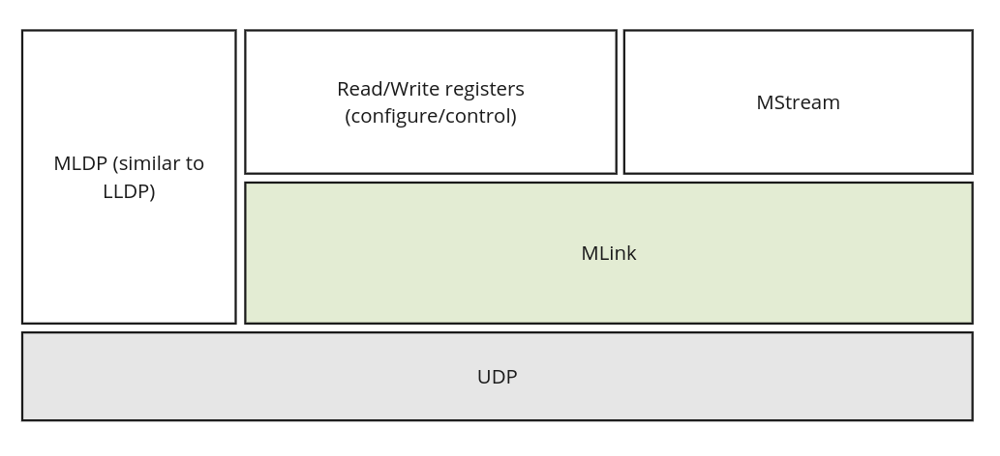
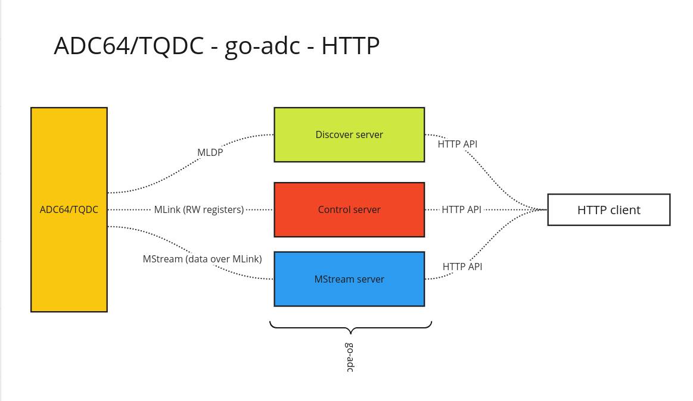
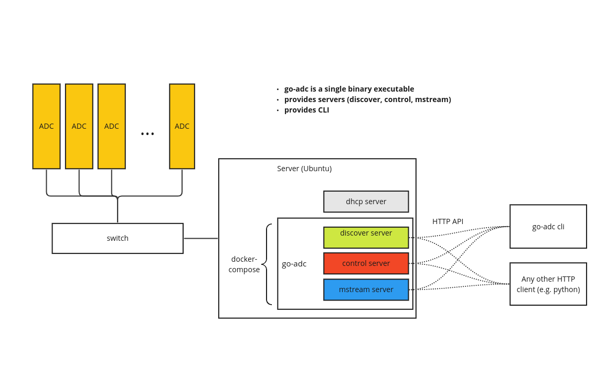

# Architecture

Here is the layer structure of the protocols used for interfacing with the ADC boards

The `go-adc` software is distributed as a single binary file that implicitly includes multiple components that implement these protocols

The whole DAQ diagram can look like

